# KAJiraUtilityPluginについて
## 概要
本プラグインは[Attlasian](https://www.atlassian.com/ja)が提供している[Jira](https://www.atlassian.com/ja/software/jira)と呼ばれるタスク管理ツールをUnrealEngine内から操作できるようにするためのツールです。

UnrealEngineのバージョンは5.3.2にて制作しております。

## 導入～初期設定まで

### 導入方法
UnrealEngineのプロジェクト内のPluginフォルダにダウンロードした本プラグインを導入し、プロジェクトを起動するだけです。
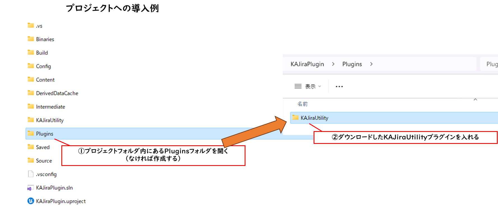

### プラグインの初期設定
プラグインが導入されたプロジェクトを開き、エディタ左上の`Edit`から`Editor Preference…`を選択し環境設定画面を開きます。

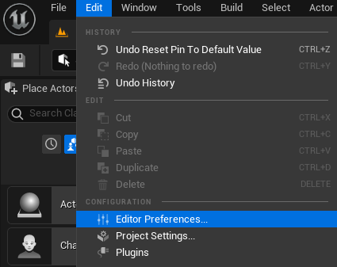

`Plugins`カテゴリ内の`KAJiraUtility`の項目にある以下のプロパティを設定します。

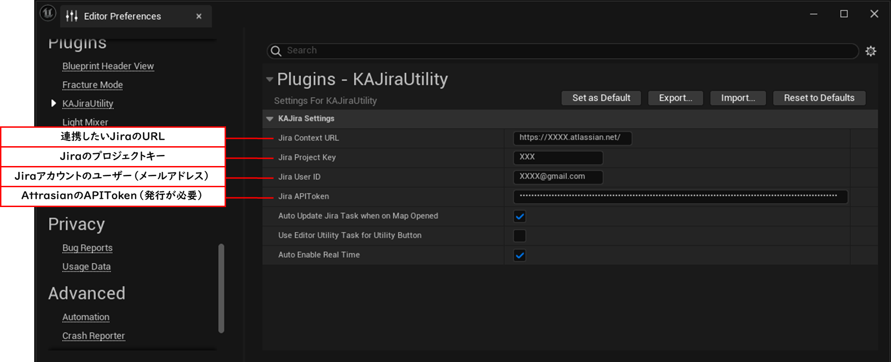

|プロパティ名|説明|詳細|
|-|-|-|
|`JiraContextURL`|連携したいJiraのURL|`https://[あなたのJiraサイト名].attlasian.net/`のような形になる|
|`JiraProjectKey`|Jiraのプロジェクトキー|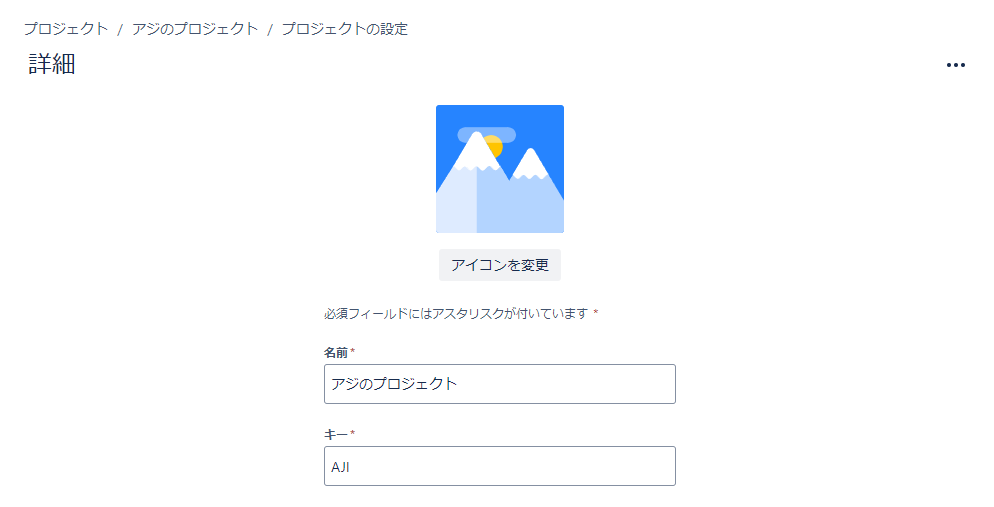Jiraページ内のプロジェクトの設定からキーを確認できる|
|`JiraUserID`|JiraのユーザーID|Jiraにログインする際のメールアドレス|
|`JiraAPIToken`|JiraのAPIToken|[APIトークンの発行](https://id.atlassian.com/manage-profile/security/api-tokens)ページから発行する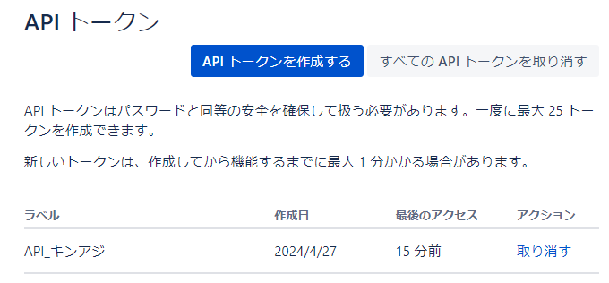|

※これらの情報はプロジェクトの`Saved/Config/WindowsEditor/Editor.ini`（Windowsの場合）に保存されます。APIトークンは他の人へ渡さないように気をつけてください。なお、本プラグインの利用によって、使用者び第三者に生じた損害においては、制作者は責任を負わないものとします。

ちなみに、運用の例として`JiraContextURL`のみ`Config/DefaultEditor.ini`に記載をすることでSourceControlでプロジェクトを共有している人全体で同じURLを使用することができるのでおすすめです。

## 使い方

### JiraTaskActor

本プラグインでは、Jiraの課題（issue）を`BP_JiraTaskActor`というアクターで同期させることができます。

**BP_JiraTaskActorの場所**

`/KAJiraUtility/KAJiraUtility/BP/BP_JIRATaskActor`

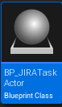

`BP_JiraTaskActor`は、既存のJiraの課題と同期させ、レベル上に情報を表示することができます。

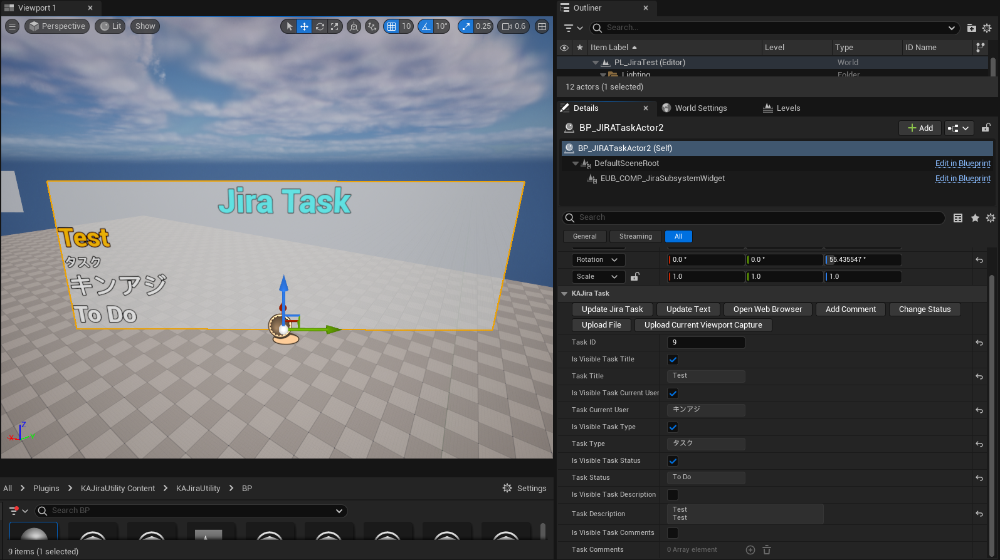

Jiraの課題と同期させるには、課題のID（Key）と`BP_JiraTaskActor`の`TaskID`へ入力します。課題のIDはサイト上では`[プロジェクトキー]-[課題のID]`のような表記で確認ができます。

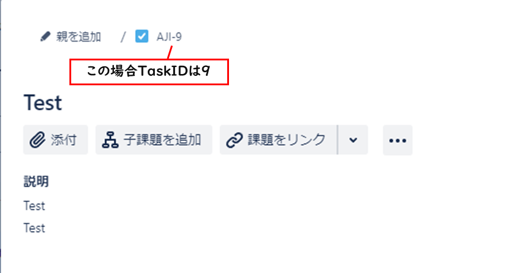

TaskIDは入力すると自動で同期します。

`BP_JiraTaskActor`のその他のプロパティおよびツールボタンの機能に関しては以下を御覧ください。

#### BP_JiraTaskActorのプロパティ

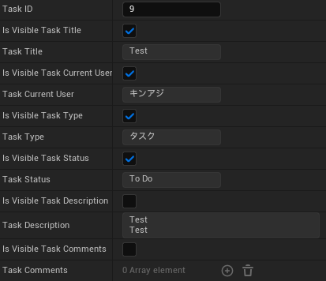

|プロパティ名|説明|詳細|
|-|-|-|
|TaskID|課題のID|編集可能|
|bIsVisibleTaskTitle|課題のタイトルをWidgetComponentで表示するかどうか|編集可能　デフォルトで有効|
|TaskTitle|課題のタイトル|表示のみ|
|bIsVisibleTaskCurrentUser|課題の担当者をWidgetComponentで表示するかどうか|編集可能　デフォルトで有効|
|TaskCurrentUser|課題の担当者|表示のみ|
|bIsVisibleTaskType|課題の種類をWidgetComponentで表示するかどうか|編集可能　デフォルトで有効|
|TaskType|課題の種類|表示のみ|
|bIsVisibleTaskStatus|課題のステータスをWidgetComponentで表示するかどうか|編集可能　デフォルトで有効|
|TaskStatus|課題のステータス|表示のみ|
|bIsVisibleTaskDescription|課題の説明をWidgetComponentで表示するかどうか|編集可能　デフォルトで無効|
|TaskDescription|課題の説明|表示のみ|
|bIsVisibleTaskComments|課題のコメントをWidgetComponentで表示するかどうか|編集可能　デフォルトで無効|
|TaskComments|課題のコメント|表示のみ|

#### BP_JiraTaskActorのツールボタン

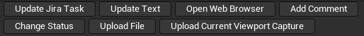

|ボタン名名|説明|詳細|
|-|-|-|
|UpdateJiraTask|課題を更新（同期）する|基本的には自動同期だが、ブラウザでJiraを更新した後に同期させたい場合等に使う|
|UpdateText|WidgetComponentの表示を更新する|ビューポート上のWidget表示がされていない時に使用する（基本的にはないが、ビューポートのRuntime設定が有効になったタイミングだとうまくWidgetがレイアウトされないのでこのボタンを押す）|
|OpenWebBrowser|WebBrowser上で課題を表示する|PCのデフォルトのブラウザで表示する|
|AddComment|コメントを追加する|現状は文字のみ|
|ChangeStatus|ステータスを変更する|現状のステータスから移行可能なもののみプルダウンに表示される|
|UploadFile|任意のファイルをアップロードする|ダイアログから選択する|
|UploadCurrentViewportCapture|現在のビューポートをキャプチャーし、その画像データをアップロードする|ビューポートのサイズがそのまま画像サイズになるのでキャプチャー時は注意が必要|

### JiraTaskActorManager

エディタ左上の`Window`から`JiraTaskActorManager`という項目をクリックすることで、`EUW_JiraTaskActorManager`というツールを起動することができます。

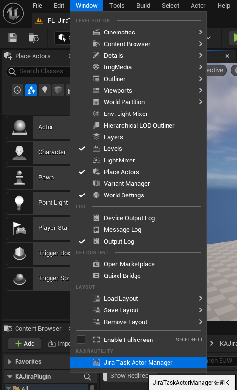

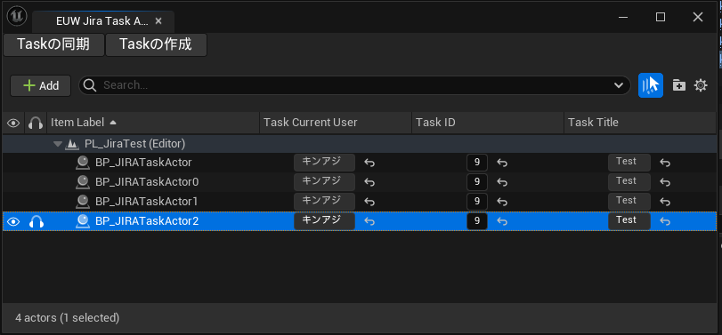

`EUW_JiraTaskActorManager`はレベル上にある`BP_JiraTaskActor`を一覧で確認することができます。また、`Taskの作成`ボタンを押すことで、新規課題をエディタ上で作成する事ができます。

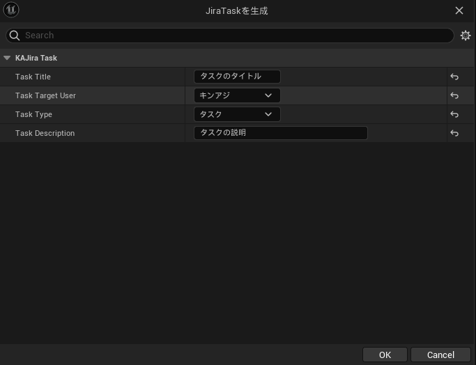

## トラブルシューティング

正常な設定を行っていれば、Jiraとの連携はうまく動作するかと思いますが、以下によくあるトラブルとその解決方法を記載します。

|問題|解決方法|詳細|
|-|-|-|
|エラー：Issue does not exist or you do not have permission to see it.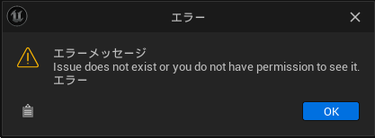|このエラーは、Jiraへのアクセスのところで拒否されているため、一度EditorPreferenceのKAJiraUtilityの各種設定を見直してください。UserIDの入力間違えやAPIトークンのコピーミス等が考えられます|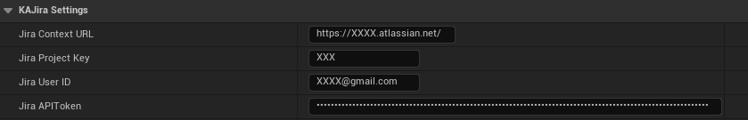|
|タスク作成時に何も書かれていないエラーが出てきます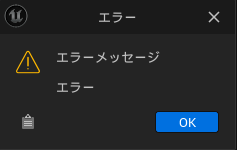|これは、タスクのタイトルに何も記載されていない場合に発生します。タイトルには何かしらの文字列を入れる必要があります|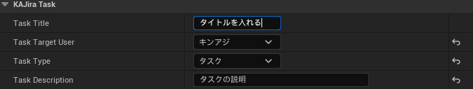|

以上